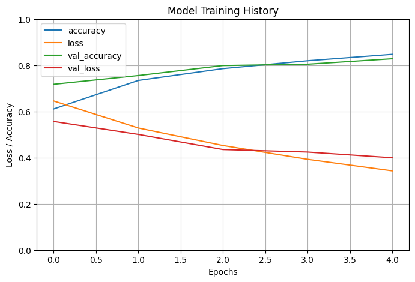

# 🐱🐶 Cats vs Dogs Image Classification (CNN)

A simple **Convolutional Neural Network (CNN)** built with TensorFlow/Keras to classify images of **cats and dogs**.
This project was done as practice for image preprocessing, CNN model building, and training on real-world image data.

---

## 📌 Project Overview

* Dataset: **[Cats vs Dogs](https://www.tensorflow.org/datasets/catalog/cats_vs_dogs)** from TensorFlow Datasets.
* Preprocessing:

  * Images resized to **150×150**
  * Normalized pixel values (scaled to \[0, 1])
  * Training/Validation split: **80/20**
  * Batched with `tf.data` pipeline and optimized with prefetching
* Model:

  * **Conv2D + MaxPooling2D** layers for feature extraction
  * **Flatten → Dense (128, ReLU) → Dense (1, Sigmoid)** for binary classification
* Training: 5 epochs, optimizer = **Adam**, loss = **Binary Crossentropy**

---

## 🚀 Tech Stack

* **Python 3**
* **TensorFlow / Keras**
* **TensorFlow Datasets (TFDS)**
* **Matplotlib, NumPy, Pandas**

---

## 📊 Results

* **Final Accuracy:**

  * Training: \~84%
  * Validation: \~83%
* Clear improvement in loss & accuracy across epochs.
* Example predictions show correct classification of cats and dogs.



---

## 🛠️ How to Run

1. **Clone the repo**

```bash
git clone https://github.com/<your-username>/cats-vs-dogs-cnn.git
cd cats-vs-dogs-cnn
```

2. **Install dependencies**

```bash
pip install -r requirements.txt
```

3. **Run the notebook**
   Open `Image classification cats_dogs.ipynb` in Jupyter/Colab and run all cells.

---

## 📚 Learning Outcomes

* Building CNNs with Keras Sequential API
* Dataset loading & preprocessing with TensorFlow Datasets
* Avoiding overfitting with proper batching, normalization, and shuffling
* Visualizing training curves & predictions

---

## 🤝 Contributing

This is a practice project, but feel free to fork and experiment with:

* Adding **Dropout** / **Batch Normalization**
* Using **Transfer Learning (e.g., MobileNet, VGG16)**
* Training longer for higher accuracy
